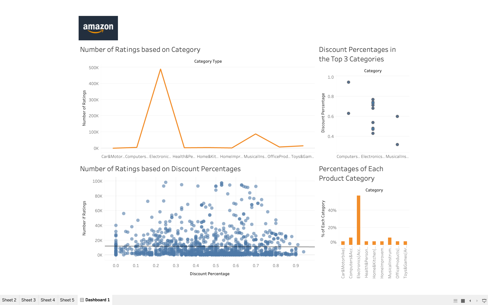
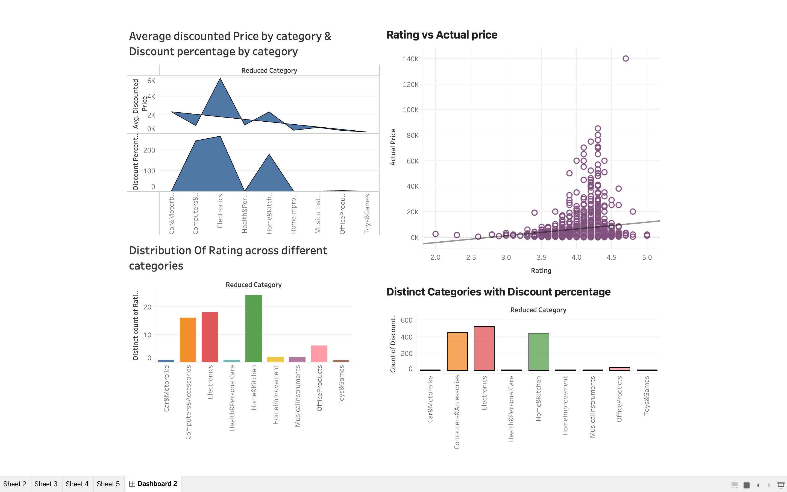

# Group 61 - Analyzing Amazon: A Data Exploration Project

## Milestones

Details for Milestone are available on Canvas (left sidebar, Course Project).

## Describe your topic/interest in about 150-200 words

The Amazon sales dataset piques our interest due to the company's significant influence in the global e-commerce industry and our personal experience as loyal Amazon customers. We are curious about the various factors and trends that contribute to the pricing of products and their significance. By analyzing Amazon's sales data, we aim to gain valuable insights into the company's business strategies and operations. Our specific research questions include identifying trends in the dataset, exploring the impact of discounts on product ratings, and examining how the number of reviews affects product ratings. These research questions reflect our broader objective of gaining a deeper understanding of how different factors influence product performance on Amazon's platform. Through this analysis, we hope to uncover useful information that can inform business decision-making, improve the overall performance of Amazon's marketplace, and potentially offer insights that can be applied to other e-commerce platforms. Yes, we can build a user friendly dashboard with this data set.

## Describe your dataset in about 150-200 words

The dataset was found on kaggle.com. The data was provided by Karkavel Raja J, who scraped the data from the Amazon website. He is a Postgraduate Student from Puducherry India and is a Kaggle Novice. The data set contains information about the sales of various products on Amazon. It includes product information such as product category, product name, and brand, as well as customer information such as customer ID, date of purchase, and purchase amount. The data was collected between 2016 and 2018. The purpose of the dataset is to provide an opportunity for analysis and insights into the sales trends and customer behaviours on Amazon. It is to understand these trends and what affects the sales of Amazon products. This dataset can also help us in exploring data analysis and data visualization.  The data was collected using web scraping techniques, where the data was extracted from the Amazon website using a software tool.

## Team Members

- Mahi Gangal: I am a second year computer science student from India. I love playing with numbers!
- Pratham Shah: I am a second year comp-sci student. During Covid, I developed my liking for coding and stocks.

## Images

## References

