# <u>
Final Group Project Report for Group 61 </u>

## <u>
AMAZON DATABASE</u>

## <u>
INTRODUCTION</u>

#### Our project focuses on analyzing the Amazon sales dataset, which contains information about the sales of various products on Amazon between 2016 and 2018. This dataset was obtained from Kaggle. The dataset includes product information such as product category, product name, and brand, as well as customer information such as customer ID, date of purchase, and purchase amount. Our interest in this dataset is due to Amazon's significant influence in the global e-commerce industry and our personal experience as loyal Amazon customers. Through our analysis of this dataset, we aim to gain valuable insights into the company's business strategies and operations. Our research questions include identifying trends in the dataset, exploring the impact of discounts on product ratings, and examining how the number of reviews affects product ratings. By answering these research questions, we hope to uncover useful information that can inform business decision-making and improve the overall performance of Amazon's marketplace. 

### <u>
Research Questions for Pratham Shah</u>

1. **Rating vs Actual price** : I have created a Scatter plot with Regression line for depicting the trend between Rating and Actual price. From the plot we know that most products have rating between 3.5 and 4.5 and the price for moost products with ratingog 4.0 is ₹5000.

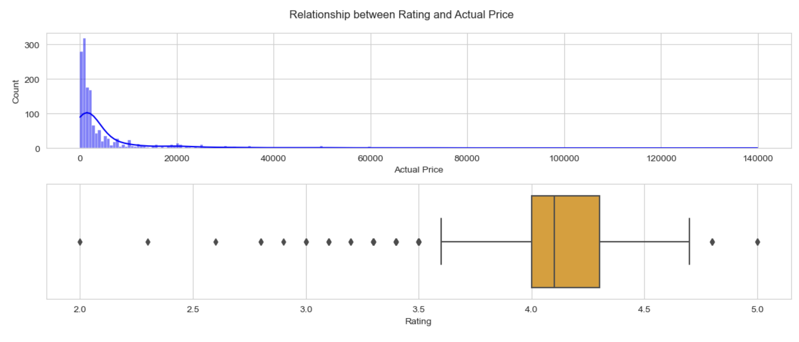

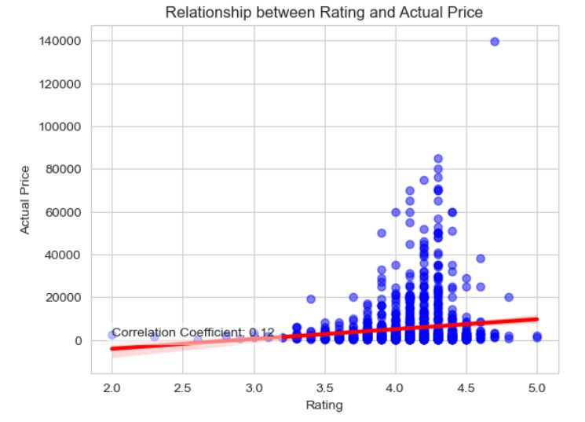

**This plot clearly shows that there is a weak positive correlation between rating and price, meaning that higher rated products tend to have higher prices, but not by much The slope of the regression line is small and close to zero, indicating that the change in price with respect to rating is not significant. The average price for a product with rating 4.0 is around ₹5000, according to the regression line.**

2. **Distinct Categories with Discount percentage**: This reseaech is useful to know which product categories offer significant discounts and which do not. The following can be used to decide on pricing and discounting methods. Also, it might reveal information about consumer preferences and purchasing patterns because some product categories might be more well-liked and therefore more likely to receive discounts.

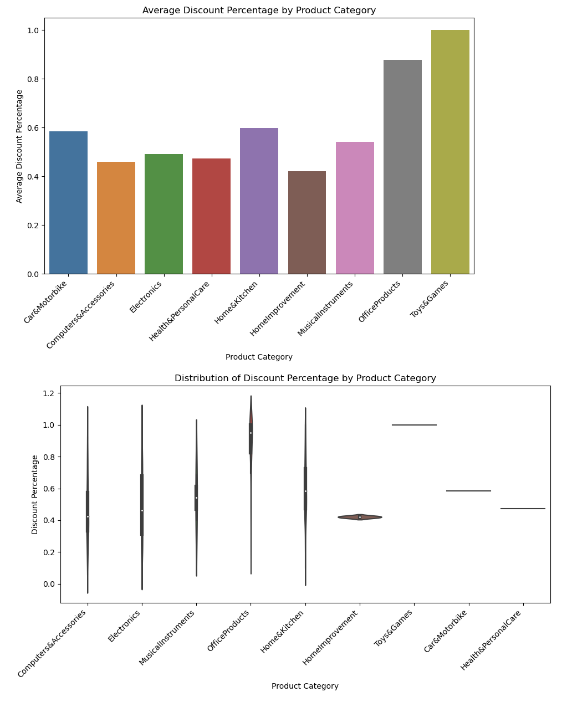

**The bar plot shows us the average discount percentage for each product category, while the violin plot shows the distribution of discount percentage within each category. From the bar plot, we can see that Office Products and Toys and games have the highest average discount percentage, while Home improvement has the lowest. This information can help us understand which categories tend to have more discounts and which ones tend to have less.
The violin plot provides us with more information about the distribution of discount percentage within each category. For example, we can see that the distribution of discounts for Electronics is quite wide, with some products having very high discounts and others having very low discounts. On the other hand, the distribution for Toys and Games is relatively narrow, showing heavier discounts. Overall, these plots provide us with valuable insights into the discount patterns within each product category, which can be usefull for business optimization for their pricing strategies.**

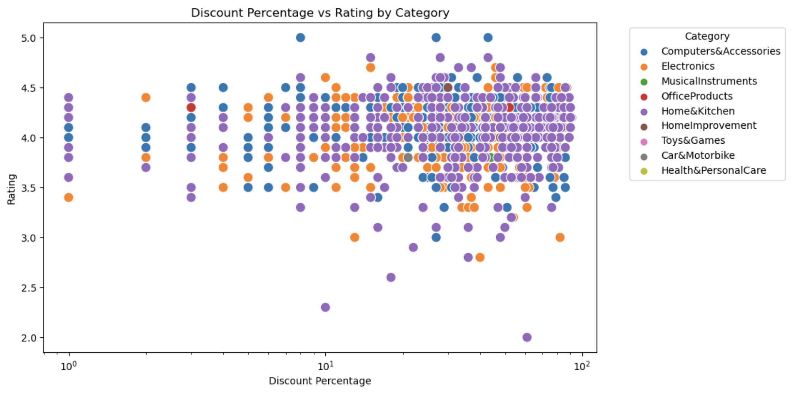

**Based on the scatter plot of Discount Percentage vs Rating by Category, we can conclude that:
Most of the products with high ratings (above 3.5) are sold at a discount of around 10^1 to 10^2 percent.The reduced_category variable shows that the majority of the high-rated products sold at a discount belong to the categories 'Electronics','Computer and Accessories' and 'Home & Kitchen'. The categories 'Electronics' and 'Mobiles & Accessories' have a wider range of discount percentages for products with high ratings. The purple and orange dots represent the categories'Home & Kitchen' and 'Electronics', respectively, which have the most high-rated products sold at a discount.**

3. **Discount percentage vs rating of the products** : Plotting Rating vs Discount price did not give much of a significant result. Thereby I want to see how does Discount percentage affect the rating of the product.

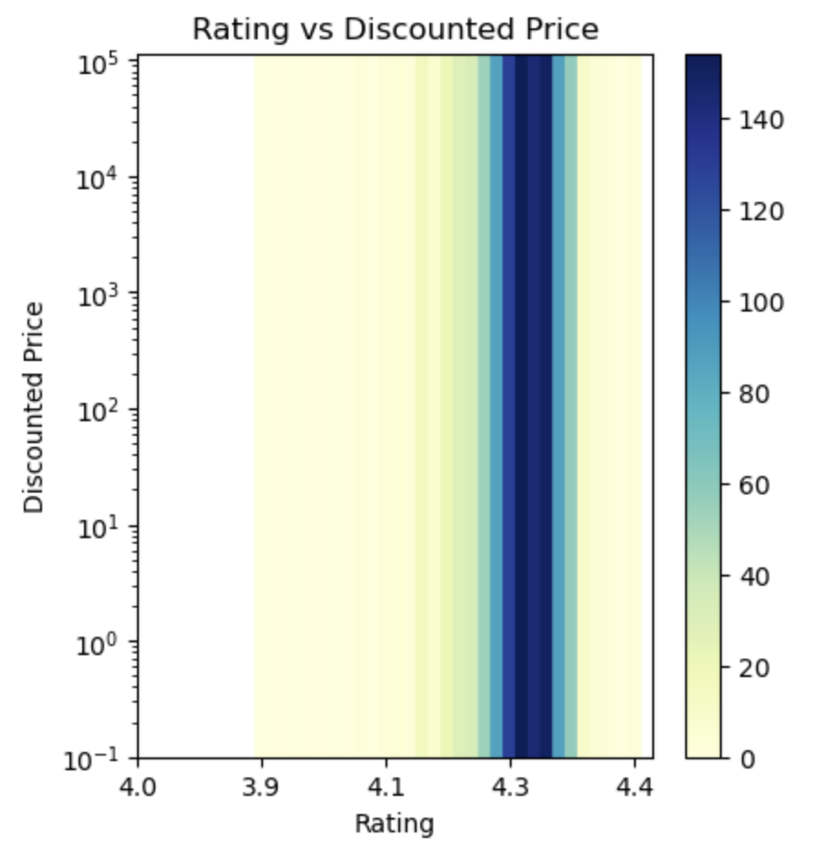

**First we have seen the distribution of rating across Discounted price. This plot shows that most of the products have ratings between 4 and 5 and the discounted price of most products with rating of 4.2 and more is between 100 to 140.**

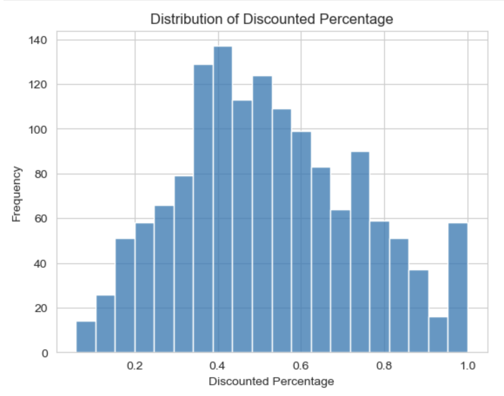

**The distribution of discounted percentage shows the frequency distribution of the discount amounts across all the products in the dataset. It gives us an idea of the typical discount percentage that is offered on products in the dataset and how frequently these discounts occur. The x-axis represents the different ranges of discounted percentage and the y-axis represents the frequency of products falling within that range. The histogram shows that the majority of products have a discounted percentage of around 0.4-0.6%.**

4. **Number of ratingcount vary with the actual price of the products** It can help to determine what segment of price attracts most customers. As higher number of ratingcount=Higher sale of a particular product.

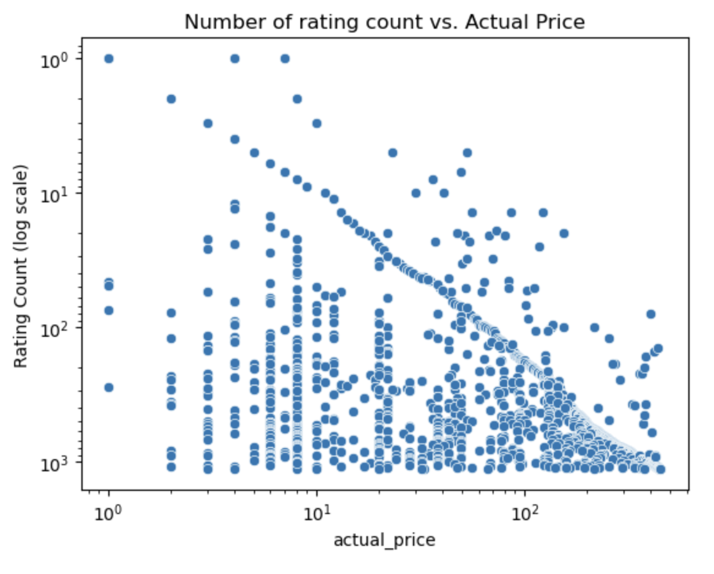

**The scatter plot shows the relationship between the actual price of the products and the number of reviews (rating count). The plot shows that for lower actual prices, there are very few reviews (sparse points). As the actual price increases, the number of reviews increases, and the points become more closely packed. Between actual prices of 10^1 to 10^2, the points are densely packed indicating a high number of reviews for products with these prices. The y-axis shows the logarithmic scale of the number of reviews, and it indicates that most products have fewer than 10^3 reviews, with points being more closely packed between 10^2 to 10^3.**

**You can find the full analysis notebook [here](https://github.com/ubco-W2022T2-data301/project-group-group61/blob/main/analysis/analysis2.ipynb), including the code and the data.**

### <u>
Research Questions for Mahi Gangal</u>

1. **How discounts can affect the sales and number of ratings of different products?**

I would like to understand if there are any relations between discounts and customer ratings for different products. 

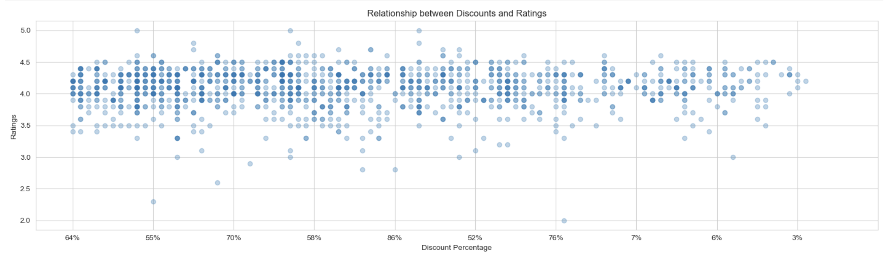

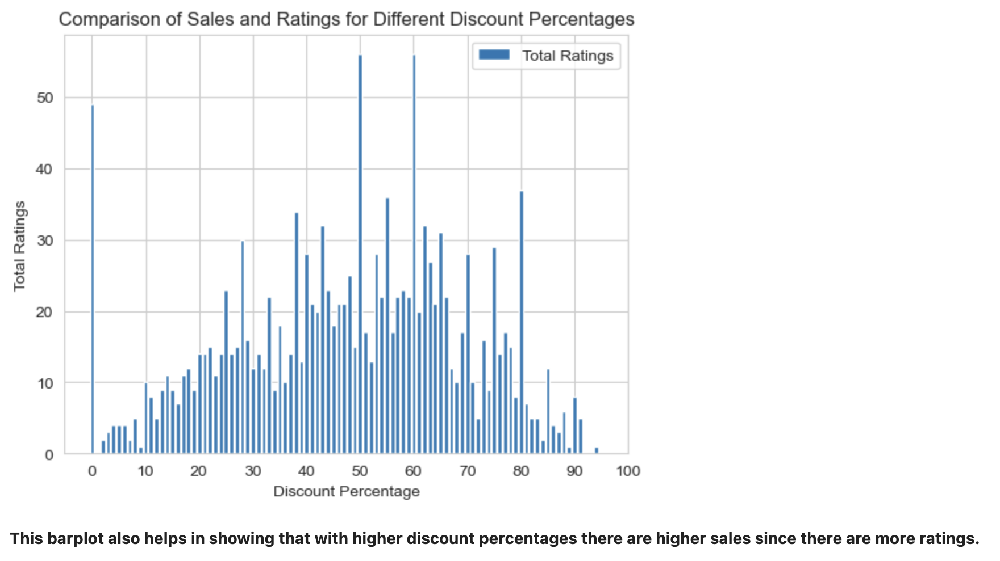

**I made 2 data visualizations for my 1st research question. First, a scatterplot that helps us visualise the relationship between discount percentages and the customer ratings. We can see from the plot that products with higher discount percentages have higher ratings and higher sales. This suggests that customers may be more price-sensitive than rating-sensitive when it comes to purchasing products. Second, I created a barchart between the discount percentages and thhe count of ratings. This helps us analyzing the ranges of discount percentages which have higher sales as they have higher ratings. We can see that ranges from 40-50% and 60-80% have higher number of ratings, therefore higher sales.**

2. **Which category of products has the highest sale?**

Generally, people prefer to shop online for only a certian category of products and tend to go to shops themselves to buy something that they actually need to try before buying.

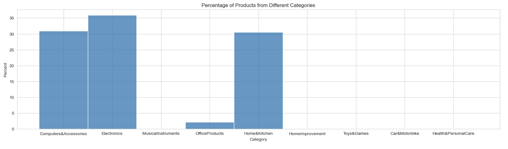

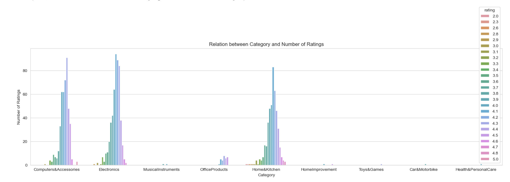

**For my 2nd research question, I have made one histogram and one count plot. They both show me that Electronics has the highest sale, followed by Computer and Accessories and then Home and Kitchen. The first visualization tells us this by calculating the percentages of all the categories as a whole. The second plot tells us this on the basis of number of ratings. We can also see that Toys and Games have the least sale. I got the unique categories by creating another colum called 'reduced_category'. This helped in analyzing the different types of categories.**

3. **How there is variation in the discount percentage in the top 3 categories?**

This question was interesting to analyse as it includes analysis from my other 2 research questions.

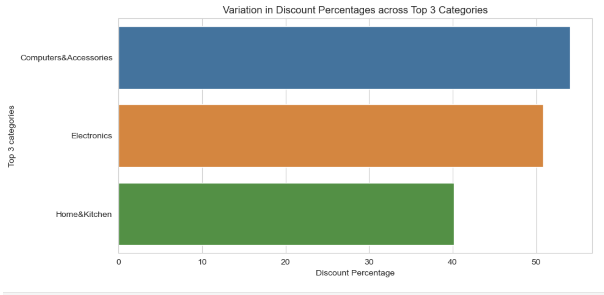

**For analyzing thie reserach question, I have made one bar plot and one bar chart. I made the bar plot by first finding the top 3 categories and then plotting them based on their discount percentages. Both of them show that Computer and Accessories have the highest discount percentages, even though Electronics is the category with the most sales, as we saw from the data visualization of my second reserach question. From the second visualization, we can see that the Toy and Games category do not have any discount percentages. Maybe, this can be the reason behind their minimum sales as we can see from the data visualization of my second reserach question.**

**You can find the full analysis notebook [here](https://github.com/ubco-W2022T2-data301/project-group-group61/blob/main/analysis/analysis1.ipynb), including the code and the data.**

## <u>
CONCLUSION</u>

Based on the analysis conducted, it can be inferred that the discount percentage offered on products has a significant impact on their ratings. The findings reveal that products with higher ratings are typically sold at discounts more than 10 percent, with the 'Electronics,' 'Computer and Accessories,' and 'Home & Kitchen' categories having the most highly-rated discounted products.

Additionally, the analysis suggests that the actual price of a product has an influence on the number of ratings it receives. The results indicate that while Electronics is the category with the highest sales volume, it is Computer and Accessories that has the highest discount percentages. On the other hand, the Toys and Games category appears to have the lowest sales volume.

Overall, these findings suggest that offering discounts on products can have a significant impact on their ratings, and certain categories may be more responsive to discounts than others. Specifically, Computer and Accessories may be a category to focus on when considering discount strategies, while Toys and Games may require alternative marketing tactics to increase sales.

